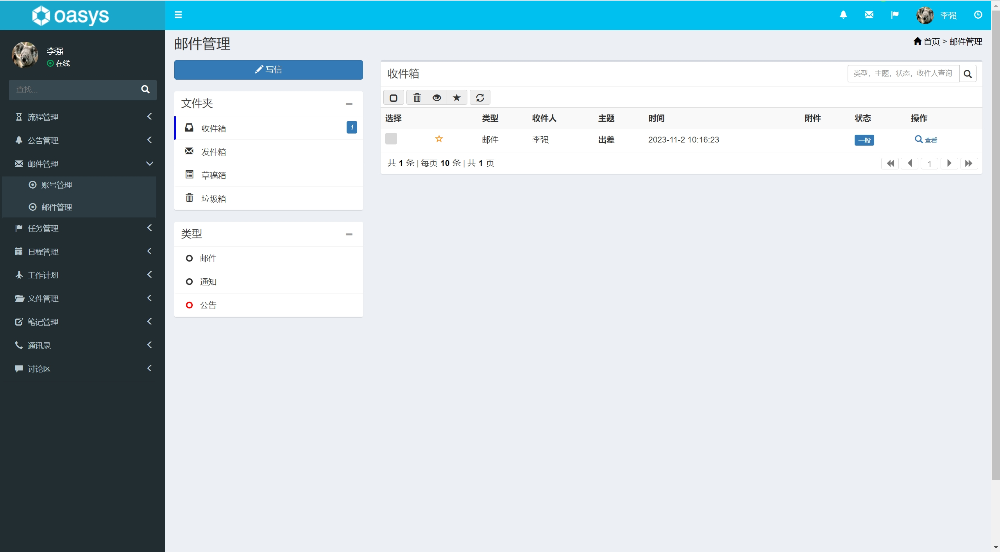

## 基于Java+Springboot的OA办公自动化人事管理系统(源码+数据库)108

## 一、系统介绍

本系统分为员工、部门经理、人事、管理员四种角色(角色菜单可以自行分配)

### 用户：
登录、考勤管理、申请管理、任务管理、日程管理、工作计划管理、文件管理、笔记管理、邮件管理、通讯录、个人信息修改。

### 管理员：
- 类型管理、菜单管理、角色管理、用户管理、职位管理、考勤管理、考勤报表管理、流程管理、公告管理、邮件管理、
- 任务管理、日程管理、工作计划管理、文件管理、笔记管理、通讯录、讨论区、个人信息修改。

## 二、所用技术
后端技术栈：
- Springboot
- SpringMvc
- Jpa
- mybatis
- mysql

前端技术栈：
- freemarker
- Bootstrap
- Jquery
- css
- ajax

## 三、环境介绍
基础环境 :IDEA/eclipse, JDK 1.8, Mysql5.7及以上, Maven3.6

所有项目以及源代码本人均调试运行无问题 可支持远程调试运行

## 四、页面截图
### 1、管理员页面

### 2、员工页面

## 五、浏览地址
 访问路径：http://localhost:8088 
          
- 管理员：  admin/123456
- 员工：    李强/123456
- 部门经理： 李明/123456
- 人事： 朱茵/123456

## 六、安装教程

1. 使用Navicat或者其它工具，在mysql中创建对应名称的数据库，并执行项目的sql

2. 使用IDEA/Eclipse导入oaSystem项目，导入时，若为maven项目请选择maven; 等待依赖下载完成

3. 修改resources目录下面application.properties里面的数据库配置和文件路径配置

4. cn/gson/oasys/OasysApplication.java启动后端项目

